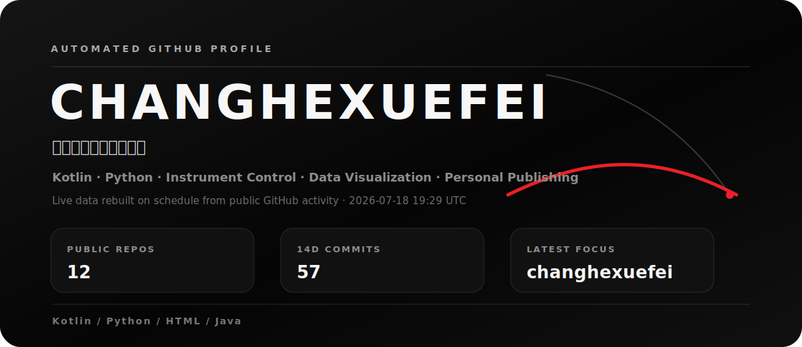
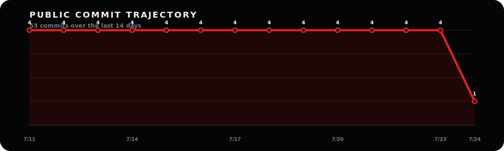

<p align="center">
  
</p>

<p align="center">
  <a href="https://changhexuefei.github.io/"><strong>PERSONAL SITE</strong></a>
  &nbsp;&nbsp;·&nbsp;&nbsp;
  <a href="https://github.com/changhexuefei"><strong>GITHUB</strong></a>
</p>

## Live System

This profile is rebuilt automatically from public GitHub activity. The layout keeps a clean, high-contrast, Tesla-inspired feel while the content follows the repositories that changed most recently.

- Public repositories scanned: **12**
- Public commits in the last 14 days: **34**
- Last generated: **2026-07-05 04:18 UTC**

<p align="center">
  
</p>

## Build Direction

```text
Kotlin / Compose Multiplatform / Lets-Plot
Python / PyVISA / PyMeasure
Java / JVisa
GitHub Pages / HTML / CSS / JavaScript
```

## Links

- Website: <https://changhexuefei.github.io/>
- GitHub: <https://github.com/changhexuefei>
